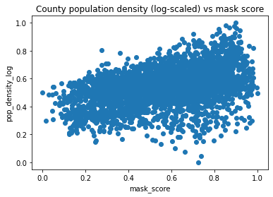

# COVID-19 Mask Use (By US County)

### Author: Jace Kline

## Abstract
In this notebook, we aim to extract value from information concerning mask use for US counties. We compare this mask usage data to the cases and deaths trends over time for each county to determine the correlation between mask use and cases/deaths. Both of these datasets were accumulated by the New York Times and were pulled from Google Cloud Platform. In addition to these data sets, we incorporate data that associates each county with its area and population. This allows us to "standardize" the growth in cases/deaths among counties despite their difference in population, density, and area. This data set was pulled from GitHub at https://github.com/ykzeng/covid-19/blob/master/data/census-landarea-all.csv. 

## Imports


```python
# General imports
import os
import re
import numpy as np
import pandas as pd
from matplotlib import pyplot as plt
from matplotlib import colors as pltcolors
import seaborn as sns
%matplotlib inline
```


```python
# Import data
initial_data = '../data/initial/'

# Import mask use by county
df_masks = pd.read_csv(initial_data + 'covid_mask_use.csv')

# Import cases by county
df_counties = pd.read_csv(initial_data + 'covid_us_counties.csv')
```

## Data Cleaning
We will drop NaN values, convert data types, and order the data set by the county FIPS code.


```python
df_masks.dropna(inplace=True)
df_masks.head()
```


<div>
<table border="1" class="dataframe">
  <thead>
    <tr style="text-align: right;">
      <th></th>
      <th>county_fips_code</th>
      <th>never</th>
      <th>rarely</th>
      <th>sometimes</th>
      <th>frequently</th>
      <th>always</th>
    </tr>
  </thead>
  <tbody>
    <tr>
      <th>0</th>
      <td>15007</td>
      <td>0.0</td>
      <td>0.021</td>
      <td>0.046</td>
      <td>0.108</td>
      <td>0.825</td>
    </tr>
    <tr>
      <th>1</th>
      <td>36011</td>
      <td>0.0</td>
      <td>0.033</td>
      <td>0.072</td>
      <td>0.162</td>
      <td>0.732</td>
    </tr>
    <tr>
      <th>2</th>
      <td>48209</td>
      <td>0.0</td>
      <td>0.007</td>
      <td>0.022</td>
      <td>0.115</td>
      <td>0.855</td>
    </tr>
    <tr>
      <th>3</th>
      <td>51740</td>
      <td>0.0</td>
      <td>0.019</td>
      <td>0.122</td>
      <td>0.225</td>
      <td>0.634</td>
    </tr>
    <tr>
      <th>4</th>
      <td>17019</td>
      <td>0.0</td>
      <td>0.067</td>
      <td>0.080</td>
      <td>0.192</td>
      <td>0.661</td>
    </tr>
  </tbody>
</table>
</div>


```python
df_counties.dropna(inplace=True)
df_counties.head()
```


<div>
<table border="1" class="dataframe">
  <thead>
    <tr style="text-align: right;">
      <th></th>
      <th>date</th>
      <th>county</th>
      <th>state_name</th>
      <th>county_fips_code</th>
      <th>confirmed_cases</th>
      <th>deaths</th>
    </tr>
  </thead>
  <tbody>
    <tr>
      <th>0</th>
      <td>2020-07-14</td>
      <td>Adair</td>
      <td>Iowa</td>
      <td>19001.0</td>
      <td>17</td>
      <td>0</td>
    </tr>
    <tr>
      <th>1</th>
      <td>2020-07-15</td>
      <td>Adair</td>
      <td>Iowa</td>
      <td>19001.0</td>
      <td>17</td>
      <td>0</td>
    </tr>
    <tr>
      <th>2</th>
      <td>2020-07-16</td>
      <td>Adair</td>
      <td>Iowa</td>
      <td>19001.0</td>
      <td>19</td>
      <td>0</td>
    </tr>
    <tr>
      <th>3</th>
      <td>2020-07-17</td>
      <td>Adair</td>
      <td>Iowa</td>
      <td>19001.0</td>
      <td>19</td>
      <td>0</td>
    </tr>
    <tr>
      <th>4</th>
      <td>2020-07-18</td>
      <td>Adair</td>
      <td>Iowa</td>
      <td>19001.0</td>
      <td>20</td>
      <td>0</td>
    </tr>
  </tbody>
</table>
</div>


```python
df_masks.shape
```


    (3142, 6)


```python
df_counties.shape
```


    (648129, 6)


```python
# Convert county_fips_code to integer value
df_counties.county_fips_code = df_counties.county_fips_code.astype(int)
```


```python
# Filter counties that are only present in the df_masks dataset
df_counties = pd.merge(df_counties, df_masks.county_fips_code, how='inner', on='county_fips_code')
df_counties.shape
```


    (634109, 6)


```python
# Convert 'date' column to datetime object
df_counties.date = pd.to_datetime(df_counties.date)
```


```python
# Number of unique counties?
unique_county_codes = np.unique(df_counties.county_fips_code)
print('Number of unique counties: {}'.format(len(unique_county_codes)))
```

    Number of unique counties: 3132


```python
# Filter a dataframe's by the counties present in the df_masks dataframe
# We assume we the input dataframe has a 'county_fips_code' attribute
def filter_county_rows(df):
    return df[pd.Series(map(lambda x: x in unique_county_codes, df.county_fips_code))]
```


```python
# Keep only counties present in the df_counties data set
# df_masks = df_masks[pd.Series(map(lambda x: x in unique_county_codes, df_masks.county_fips_code))]
df_masks = filter_county_rows(df_masks)
```


```python
# Sort masks data set by county code (ascending)
df_masks = df_masks.sort_values('county_fips_code').reset_index().drop('index', axis=1)
df_masks.head()
```


<div>
<table border="1" class="dataframe">
  <thead>
    <tr style="text-align: right;">
      <th></th>
      <th>county_fips_code</th>
      <th>never</th>
      <th>rarely</th>
      <th>sometimes</th>
      <th>frequently</th>
      <th>always</th>
    </tr>
  </thead>
  <tbody>
    <tr>
      <th>0</th>
      <td>1001</td>
      <td>0.053</td>
      <td>0.074</td>
      <td>0.134</td>
      <td>0.295</td>
      <td>0.444</td>
    </tr>
    <tr>
      <th>1</th>
      <td>1003</td>
      <td>0.083</td>
      <td>0.059</td>
      <td>0.098</td>
      <td>0.323</td>
      <td>0.436</td>
    </tr>
    <tr>
      <th>2</th>
      <td>1005</td>
      <td>0.067</td>
      <td>0.121</td>
      <td>0.120</td>
      <td>0.201</td>
      <td>0.491</td>
    </tr>
    <tr>
      <th>3</th>
      <td>1007</td>
      <td>0.020</td>
      <td>0.034</td>
      <td>0.096</td>
      <td>0.278</td>
      <td>0.572</td>
    </tr>
    <tr>
      <th>4</th>
      <td>1009</td>
      <td>0.053</td>
      <td>0.114</td>
      <td>0.180</td>
      <td>0.194</td>
      <td>0.459</td>
    </tr>
  </tbody>
</table>
</div>


```python
# Sort counties data set by county code and then date
df_counties = df_counties.sort_values(['county_fips_code', 'date']).reset_index().drop('index', axis=1)
df_counties.head()
```


<div>
<table border="1" class="dataframe">
  <thead>
    <tr style="text-align: right;">
      <th></th>
      <th>date</th>
      <th>county</th>
      <th>state_name</th>
      <th>county_fips_code</th>
      <th>confirmed_cases</th>
      <th>deaths</th>
    </tr>
  </thead>
  <tbody>
    <tr>
      <th>0</th>
      <td>2020-03-24</td>
      <td>Autauga</td>
      <td>Alabama</td>
      <td>1001</td>
      <td>1</td>
      <td>0</td>
    </tr>
    <tr>
      <th>1</th>
      <td>2020-03-25</td>
      <td>Autauga</td>
      <td>Alabama</td>
      <td>1001</td>
      <td>4</td>
      <td>0</td>
    </tr>
    <tr>
      <th>2</th>
      <td>2020-03-26</td>
      <td>Autauga</td>
      <td>Alabama</td>
      <td>1001</td>
      <td>6</td>
      <td>0</td>
    </tr>
    <tr>
      <th>3</th>
      <td>2020-03-27</td>
      <td>Autauga</td>
      <td>Alabama</td>
      <td>1001</td>
      <td>6</td>
      <td>0</td>
    </tr>
    <tr>
      <th>4</th>
      <td>2020-03-28</td>
      <td>Autauga</td>
      <td>Alabama</td>
      <td>1001</td>
      <td>6</td>
      <td>0</td>
    </tr>
  </tbody>
</table>
</div>


## Data Transformation


```python
df_masks.describe()
```


<div>
<table border="1" class="dataframe">
  <thead>
    <tr style="text-align: right;">
      <th></th>
      <th>county_fips_code</th>
      <th>never</th>
      <th>rarely</th>
      <th>sometimes</th>
      <th>frequently</th>
      <th>always</th>
    </tr>
  </thead>
  <tbody>
    <tr>
      <th>count</th>
      <td>3132.000000</td>
      <td>3132.000000</td>
      <td>3132.000000</td>
      <td>3132.000000</td>
      <td>3132.000000</td>
      <td>3132.000000</td>
    </tr>
    <tr>
      <th>mean</th>
      <td>30391.265964</td>
      <td>0.080044</td>
      <td>0.083106</td>
      <td>0.121512</td>
      <td>0.207805</td>
      <td>0.507526</td>
    </tr>
    <tr>
      <th>std</th>
      <td>15162.386237</td>
      <td>0.058582</td>
      <td>0.055443</td>
      <td>0.057973</td>
      <td>0.063328</td>
      <td>0.151830</td>
    </tr>
    <tr>
      <th>min</th>
      <td>1001.000000</td>
      <td>0.000000</td>
      <td>0.000000</td>
      <td>0.001000</td>
      <td>0.029000</td>
      <td>0.115000</td>
    </tr>
    <tr>
      <th>25%</th>
      <td>18178.500000</td>
      <td>0.034000</td>
      <td>0.040000</td>
      <td>0.079000</td>
      <td>0.164000</td>
      <td>0.393000</td>
    </tr>
    <tr>
      <th>50%</th>
      <td>29172.000000</td>
      <td>0.068000</td>
      <td>0.073000</td>
      <td>0.116000</td>
      <td>0.204000</td>
      <td>0.497000</td>
    </tr>
    <tr>
      <th>75%</th>
      <td>45083.500000</td>
      <td>0.113000</td>
      <td>0.115000</td>
      <td>0.157000</td>
      <td>0.247000</td>
      <td>0.613000</td>
    </tr>
    <tr>
      <th>max</th>
      <td>56045.000000</td>
      <td>0.432000</td>
      <td>0.384000</td>
      <td>0.422000</td>
      <td>0.549000</td>
      <td>0.889000</td>
    </tr>
  </tbody>
</table>
</div>


```python
# Calculate the average percentages that counties report each mask-wearing frequency measure
wearing_freqs = ['never', 'rarely', 'sometimes', 'frequently', 'always']
wearing_freq_avgs = list(map(lambda freq: df_masks[freq].mean(), wearing_freqs))
wearing_freq_avgs
```


    [0.08004406130268177,
     0.08310632183908029,
     0.12151213282247755,
     0.20780523627075373,
     0.5075261813537669]


### Computing a "Mask Score" for each county

We shall compute a mask score for each county. The higher the score, the more the population of that county adheres to mask wearing. See below for the linear transformation used to compute the mask score.


```python
# Given a list of 5 mask wearing frequency proportions for a county, compute a mask-wearing "score" for that county
def mask_score(proportions):
    weights = [-1, -0.5, 0, 0.5, 1]
    terms = list(map(lambda i: weights[i] * (proportions[i] / wearing_freq_avgs[i]), range(0, 5)))
    return sum(terms)
```


```python
def proportions(row):
    return list(map(lambda freq: row[freq], wearing_freqs))
```


```python
# testing the mask_score() function
mask_score(proportions(df_masks.iloc[0]))
```


    0.4772828222866382


```python
# Map each county to a 'mask_score'
df_masks['mask_score'] = df_masks.apply(lambda r: mask_score(proportions(r)), axis=1)
```


```python
df_masks
```


<div>
<table border="1" class="dataframe">
  <thead>
    <tr style="text-align: right;">
      <th></th>
      <th>county_fips_code</th>
      <th>never</th>
      <th>rarely</th>
      <th>sometimes</th>
      <th>frequently</th>
      <th>always</th>
      <th>mask_score</th>
    </tr>
  </thead>
  <tbody>
    <tr>
      <th>0</th>
      <td>1001</td>
      <td>0.053</td>
      <td>0.074</td>
      <td>0.134</td>
      <td>0.295</td>
      <td>0.444</td>
      <td>0.477283</td>
    </tr>
    <tr>
      <th>1</th>
      <td>1003</td>
      <td>0.083</td>
      <td>0.059</td>
      <td>0.098</td>
      <td>0.323</td>
      <td>0.436</td>
      <td>0.244343</td>
    </tr>
    <tr>
      <th>2</th>
      <td>1005</td>
      <td>0.067</td>
      <td>0.121</td>
      <td>0.120</td>
      <td>0.201</td>
      <td>0.491</td>
      <td>-0.113958</td>
    </tr>
    <tr>
      <th>3</th>
      <td>1007</td>
      <td>0.020</td>
      <td>0.034</td>
      <td>0.096</td>
      <td>0.278</td>
      <td>0.572</td>
      <td>1.341511</td>
    </tr>
    <tr>
      <th>4</th>
      <td>1009</td>
      <td>0.053</td>
      <td>0.114</td>
      <td>0.180</td>
      <td>0.194</td>
      <td>0.459</td>
      <td>0.023166</td>
    </tr>
    <tr>
      <th>...</th>
      <td>...</td>
      <td>...</td>
      <td>...</td>
      <td>...</td>
      <td>...</td>
      <td>...</td>
      <td>...</td>
    </tr>
    <tr>
      <th>3127</th>
      <td>56037</td>
      <td>0.061</td>
      <td>0.295</td>
      <td>0.230</td>
      <td>0.146</td>
      <td>0.268</td>
      <td>-1.657573</td>
    </tr>
    <tr>
      <th>3128</th>
      <td>56039</td>
      <td>0.095</td>
      <td>0.157</td>
      <td>0.160</td>
      <td>0.247</td>
      <td>0.340</td>
      <td>-0.867197</td>
    </tr>
    <tr>
      <th>3129</th>
      <td>56041</td>
      <td>0.098</td>
      <td>0.278</td>
      <td>0.154</td>
      <td>0.207</td>
      <td>0.264</td>
      <td>-1.878649</td>
    </tr>
    <tr>
      <th>3130</th>
      <td>56043</td>
      <td>0.204</td>
      <td>0.155</td>
      <td>0.069</td>
      <td>0.285</td>
      <td>0.287</td>
      <td>-2.229910</td>
    </tr>
    <tr>
      <th>3131</th>
      <td>56045</td>
      <td>0.142</td>
      <td>0.129</td>
      <td>0.148</td>
      <td>0.207</td>
      <td>0.374</td>
      <td>-1.315167</td>
    </tr>
  </tbody>
</table>
<p>3132 rows × 7 columns</p>
</div>


### Standardizing and Normalizing the Mask Score feature
Now that we have mapped each county to a mask score, we shall standardize and normalize the values to be roughly evenly distributed and fall between values 0 and 1.


```python
# Standardize: mean = 0, stdev = 1
def standardize(ser):
    return (ser - ser.mean()) / ser.std()
```


```python
# Normalize: min = 0, max = 1
def normalize(ser):
    return (ser - ser.min()) / (ser.max() - ser.min())
```


```python
# Standardize, normalize
df_masks.mask_score = normalize(standardize(df_masks.mask_score))
```


```python
# Set index to county code
df_masks.set_index('county_fips_code')
```


<div>
<table border="1" class="dataframe">
  <thead>
    <tr style="text-align: right;">
      <th></th>
      <th>never</th>
      <th>rarely</th>
      <th>sometimes</th>
      <th>frequently</th>
      <th>always</th>
      <th>mask_score</th>
    </tr>
    <tr>
      <th>county_fips_code</th>
      <th></th>
      <th></th>
      <th></th>
      <th></th>
      <th></th>
      <th></th>
    </tr>
  </thead>
  <tbody>
    <tr>
      <th>1001</th>
      <td>0.053</td>
      <td>0.074</td>
      <td>0.134</td>
      <td>0.295</td>
      <td>0.444</td>
      <td>0.796765</td>
    </tr>
    <tr>
      <th>1003</th>
      <td>0.083</td>
      <td>0.059</td>
      <td>0.098</td>
      <td>0.323</td>
      <td>0.436</td>
      <td>0.765844</td>
    </tr>
    <tr>
      <th>1005</th>
      <td>0.067</td>
      <td>0.121</td>
      <td>0.120</td>
      <td>0.201</td>
      <td>0.491</td>
      <td>0.718280</td>
    </tr>
    <tr>
      <th>1007</th>
      <td>0.020</td>
      <td>0.034</td>
      <td>0.096</td>
      <td>0.278</td>
      <td>0.572</td>
      <td>0.911489</td>
    </tr>
    <tr>
      <th>1009</th>
      <td>0.053</td>
      <td>0.114</td>
      <td>0.180</td>
      <td>0.194</td>
      <td>0.459</td>
      <td>0.736483</td>
    </tr>
    <tr>
      <th>...</th>
      <td>...</td>
      <td>...</td>
      <td>...</td>
      <td>...</td>
      <td>...</td>
      <td>...</td>
    </tr>
    <tr>
      <th>56037</th>
      <td>0.061</td>
      <td>0.295</td>
      <td>0.230</td>
      <td>0.146</td>
      <td>0.268</td>
      <td>0.513371</td>
    </tr>
    <tr>
      <th>56039</th>
      <td>0.095</td>
      <td>0.157</td>
      <td>0.160</td>
      <td>0.247</td>
      <td>0.340</td>
      <td>0.618291</td>
    </tr>
    <tr>
      <th>56041</th>
      <td>0.098</td>
      <td>0.278</td>
      <td>0.154</td>
      <td>0.207</td>
      <td>0.264</td>
      <td>0.484024</td>
    </tr>
    <tr>
      <th>56043</th>
      <td>0.204</td>
      <td>0.155</td>
      <td>0.069</td>
      <td>0.285</td>
      <td>0.287</td>
      <td>0.437395</td>
    </tr>
    <tr>
      <th>56045</th>
      <td>0.142</td>
      <td>0.129</td>
      <td>0.148</td>
      <td>0.207</td>
      <td>0.374</td>
      <td>0.558824</td>
    </tr>
  </tbody>
</table>
<p>3132 rows × 6 columns</p>
</div>


### Plotting the Mask Score distribution
We use a histogram with 100 bins to show the distribution of mask scores between 0 and 1. We see that it is skewed to the right.


```python
plt.hist(df_masks.mask_score, bins=100)
plt.xlabel('Mask score')
plt.ylabel('Counties with given mask score')
plt.savefig('../figures/mask-score-dist.png')
plt.show()
```


### Squaring the Mask Score
Since the 'mask_score' feature exists in the domain from 0 to 1 and it is skewed right, we shall square the initial mask score to get a more evenly-distributed mask score. See the breakdown below.


```python
plt.hist(np.square(df_masks.mask_score), bins=100)
plt.xlabel('Mask score ^ 2')
plt.ylabel('Counties with given mask score')
plt.savefig('../figures/mask-score-dist.png')
plt.show()
```


```python
# Square the 'mask_score' feature to even out the distribution
df_masks.mask_score = np.square(df_masks.mask_score)
```

## Importing County Population and Area Data
We shall use this data to standardize our analysis of the case/death growth over time for each county.


```python
# Import the population density dataset
df_pops = pd.read_csv(initial_data + 'census-population-landarea.csv')
df_pops.head()
```


<div>
<table border="1" class="dataframe">
  <thead>
    <tr style="text-align: right;">
      <th></th>
      <th>fips</th>
      <th>PST045212</th>
      <th>PST040210</th>
      <th>PST120212</th>
      <th>POP010210</th>
      <th>LND110210</th>
      <th>POP060210</th>
    </tr>
  </thead>
  <tbody>
    <tr>
      <th>0</th>
      <td>0</td>
      <td>313914040</td>
      <td>308747508</td>
      <td>1.7</td>
      <td>308745538</td>
      <td>3531905.43</td>
      <td>87.4</td>
    </tr>
    <tr>
      <th>1</th>
      <td>1000</td>
      <td>4822023</td>
      <td>4779745</td>
      <td>0.9</td>
      <td>4779736</td>
      <td>50645.33</td>
      <td>94.4</td>
    </tr>
    <tr>
      <th>2</th>
      <td>1001</td>
      <td>55514</td>
      <td>54571</td>
      <td>1.7</td>
      <td>54571</td>
      <td>594.44</td>
      <td>91.8</td>
    </tr>
    <tr>
      <th>3</th>
      <td>1003</td>
      <td>190790</td>
      <td>182265</td>
      <td>4.7</td>
      <td>182265</td>
      <td>1589.78</td>
      <td>114.6</td>
    </tr>
    <tr>
      <th>4</th>
      <td>1005</td>
      <td>27201</td>
      <td>27457</td>
      <td>-0.9</td>
      <td>27457</td>
      <td>884.88</td>
      <td>31.0</td>
    </tr>
  </tbody>
</table>
</div>


```python
# Keep only the relevant columns
df_pops = df_pops[['fips', 'PST045212', 'LND110210']].rename({'fips' : 'county_fips_code', 'PST045212' : 'population', 'LND110210' : 'landarea'}, axis=1)
df_pops
```


<div>
<table border="1" class="dataframe">
  <thead>
    <tr style="text-align: right;">
      <th></th>
      <th>county_fips_code</th>
      <th>population</th>
      <th>landarea</th>
    </tr>
  </thead>
  <tbody>
    <tr>
      <th>0</th>
      <td>0</td>
      <td>313914040</td>
      <td>3531905.43</td>
    </tr>
    <tr>
      <th>1</th>
      <td>1000</td>
      <td>4822023</td>
      <td>50645.33</td>
    </tr>
    <tr>
      <th>2</th>
      <td>1001</td>
      <td>55514</td>
      <td>594.44</td>
    </tr>
    <tr>
      <th>3</th>
      <td>1003</td>
      <td>190790</td>
      <td>1589.78</td>
    </tr>
    <tr>
      <th>4</th>
      <td>1005</td>
      <td>27201</td>
      <td>884.88</td>
    </tr>
    <tr>
      <th>...</th>
      <td>...</td>
      <td>...</td>
      <td>...</td>
    </tr>
    <tr>
      <th>3190</th>
      <td>56037</td>
      <td>45267</td>
      <td>10426.65</td>
    </tr>
    <tr>
      <th>3191</th>
      <td>56039</td>
      <td>21675</td>
      <td>3995.38</td>
    </tr>
    <tr>
      <th>3192</th>
      <td>56041</td>
      <td>21025</td>
      <td>2081.26</td>
    </tr>
    <tr>
      <th>3193</th>
      <td>56043</td>
      <td>8464</td>
      <td>2238.55</td>
    </tr>
    <tr>
      <th>3194</th>
      <td>56045</td>
      <td>7082</td>
      <td>2398.09</td>
    </tr>
  </tbody>
</table>
<p>3195 rows × 3 columns</p>
</div>


```python
# Filter out rows that aren't present in the mask use dataset
df_pops = filter_county_rows(df_pops)
df_pops = df_pops.set_index('county_fips_code')
df_pops.head()
```


<div>
<table border="1" class="dataframe">
  <thead>
    <tr style="text-align: right;">
      <th></th>
      <th>population</th>
      <th>landarea</th>
    </tr>
    <tr>
      <th>county_fips_code</th>
      <th></th>
      <th></th>
    </tr>
  </thead>
  <tbody>
    <tr>
      <th>1001</th>
      <td>55514</td>
      <td>594.44</td>
    </tr>
    <tr>
      <th>1003</th>
      <td>190790</td>
      <td>1589.78</td>
    </tr>
    <tr>
      <th>1005</th>
      <td>27201</td>
      <td>884.88</td>
    </tr>
    <tr>
      <th>1007</th>
      <td>22597</td>
      <td>622.58</td>
    </tr>
    <tr>
      <th>1009</th>
      <td>57826</td>
      <td>644.78</td>
    </tr>
  </tbody>
</table>
</div>


```python
# Calculate a 'pop_density' column
df_pops['pop_density'] = df_pops.population / df_pops.landarea
df_pops.head()
```


<div>
<table border="1" class="dataframe">
  <thead>
    <tr style="text-align: right;">
      <th></th>
      <th>population</th>
      <th>landarea</th>
      <th>pop_density</th>
    </tr>
    <tr>
      <th>county_fips_code</th>
      <th></th>
      <th></th>
      <th></th>
    </tr>
  </thead>
  <tbody>
    <tr>
      <th>1001</th>
      <td>55514</td>
      <td>594.44</td>
      <td>93.388736</td>
    </tr>
    <tr>
      <th>1003</th>
      <td>190790</td>
      <td>1589.78</td>
      <td>120.010316</td>
    </tr>
    <tr>
      <th>1005</th>
      <td>27201</td>
      <td>884.88</td>
      <td>30.739761</td>
    </tr>
    <tr>
      <th>1007</th>
      <td>22597</td>
      <td>622.58</td>
      <td>36.295737</td>
    </tr>
    <tr>
      <th>1009</th>
      <td>57826</td>
      <td>644.78</td>
      <td>89.683303</td>
    </tr>
  </tbody>
</table>
</div>


## Computing "Change" Features
For each of the counties, we want to compute the mean and max values for each of the following: daily case growth, daily death growth, weekly case growth, weekly death growth, monthly case growth, monthly death growth. Computing these features will allow us to correlate each county with both its mask usage and case/death growth statistics. We want to focus on the growth of cases/deaths rather than total cases/deaths.


```python
def calc_diffs(df, feature, delta):
    def calc_diff(i):
        return df.loc[(i+delta),feature] - df.loc[i,feature]
    return pd.Series(list(map(calc_diff, range(0, len(df) - delta))))
```


```python
def change_features(df):
    deltas = [(1, 'daily'), (7, 'weekly'), (30, 'monthly')]
    fs = [(lambda s: s.max(), 'max'), (lambda s: s.mean(), 'mean')]
    features = [('confirmed_cases', 'cases'), ('deaths', 'deaths')]
    lbls = []
    vals = []
    for d,d_lbl in deltas:
        for f,f_lbl in fs:
            for ftr,ftr_lbl in features:
                lbls.append(d_lbl + '_change_' + ftr_lbl + '_' + f_lbl)
                vals.append(f(calc_diffs(df, ftr, d)))
    for ftr,ftr_lbl in features:
        lbls.append('total_change_' + ftr_lbl)
        vals.append(df.iloc[-1,:][ftr])
    return pd.Series(vals, index=lbls)
```


```python
def summarize_df_counties():
    dfs = list(map(lambda code: df_counties[df_counties.county_fips_code == code].reset_index(), unique_county_codes))
    rows = list(map(change_features, dfs))
    df = pd.concat(rows, axis=1).T
    df['county_fips_code'] = unique_county_codes
    df = df.set_index('county_fips_code')
    return df
```


```python
def get_counties_summary(force=False):
    write_loc = '../data/transformed/covid_us_counties_summ.csv'
    if force or not os.path.exists(write_loc):
        df = summarize_df_counties()
        df.to_csv(write_loc)
        return df
    else: 
        df = pd.read_csv(write_loc)
        df = df.set_index('county_fips_code')
        return df
```


```python
df_counties_summ = get_counties_summary()
```


```python
df_counties_summ
```


<div>
<table border="1" class="dataframe">
  <thead>
    <tr style="text-align: right;">
      <th></th>
      <th>daily_change_cases_max</th>
      <th>daily_change_deaths_max</th>
      <th>daily_change_cases_mean</th>
      <th>daily_change_deaths_mean</th>
      <th>weekly_change_cases_max</th>
      <th>weekly_change_deaths_max</th>
      <th>weekly_change_cases_mean</th>
      <th>weekly_change_deaths_mean</th>
      <th>monthly_change_cases_max</th>
      <th>monthly_change_deaths_max</th>
      <th>monthly_change_cases_mean</th>
      <th>monthly_change_deaths_mean</th>
      <th>total_change_cases</th>
      <th>total_change_deaths</th>
    </tr>
    <tr>
      <th>county_fips_code</th>
      <th></th>
      <th></th>
      <th></th>
      <th></th>
      <th></th>
      <th></th>
      <th></th>
      <th></th>
      <th></th>
      <th></th>
      <th></th>
      <th></th>
      <th></th>
      <th></th>
    </tr>
  </thead>
  <tbody>
    <tr>
      <th>1001</th>
      <td>83.0</td>
      <td>2.0</td>
      <td>9.573460</td>
      <td>0.142180</td>
      <td>168.0</td>
      <td>6.0</td>
      <td>67.712195</td>
      <td>0.970732</td>
      <td>547.0</td>
      <td>14.0</td>
      <td>304.153846</td>
      <td>4.351648</td>
      <td>2021.0</td>
      <td>30.0</td>
    </tr>
    <tr>
      <th>1003</th>
      <td>357.0</td>
      <td>8.0</td>
      <td>29.149321</td>
      <td>0.312217</td>
      <td>862.0</td>
      <td>12.0</td>
      <td>207.218605</td>
      <td>2.195349</td>
      <td>2490.0</td>
      <td>22.0</td>
      <td>930.135417</td>
      <td>9.062500</td>
      <td>6443.0</td>
      <td>69.0</td>
    </tr>
    <tr>
      <th>1005</th>
      <td>20.0</td>
      <td>2.0</td>
      <td>4.950249</td>
      <td>0.044776</td>
      <td>92.0</td>
      <td>2.0</td>
      <td>35.051282</td>
      <td>0.323077</td>
      <td>272.0</td>
      <td>4.0</td>
      <td>157.773256</td>
      <td>1.360465</td>
      <td>996.0</td>
      <td>9.0</td>
    </tr>
    <tr>
      <th>1007</th>
      <td>29.0</td>
      <td>2.0</td>
      <td>3.897561</td>
      <td>0.068293</td>
      <td>74.0</td>
      <td>3.0</td>
      <td>27.366834</td>
      <td>0.467337</td>
      <td>236.0</td>
      <td>6.0</td>
      <td>117.375000</td>
      <td>1.926136</td>
      <td>801.0</td>
      <td>14.0</td>
    </tr>
    <tr>
      <th>1009</th>
      <td>38.0</td>
      <td>7.0</td>
      <td>8.914286</td>
      <td>0.119048</td>
      <td>179.0</td>
      <td>8.0</td>
      <td>62.328431</td>
      <td>0.803922</td>
      <td>647.0</td>
      <td>11.0</td>
      <td>278.458564</td>
      <td>2.889503</td>
      <td>1873.0</td>
      <td>25.0</td>
    </tr>
    <tr>
      <th>...</th>
      <td>...</td>
      <td>...</td>
      <td>...</td>
      <td>...</td>
      <td>...</td>
      <td>...</td>
      <td>...</td>
      <td>...</td>
      <td>...</td>
      <td>...</td>
      <td>...</td>
      <td>...</td>
      <td>...</td>
      <td>...</td>
    </tr>
    <tr>
      <th>56037</th>
      <td>13.0</td>
      <td>1.0</td>
      <td>2.061611</td>
      <td>0.009479</td>
      <td>48.0</td>
      <td>2.0</td>
      <td>14.243902</td>
      <td>0.068293</td>
      <td>151.0</td>
      <td>2.0</td>
      <td>60.230769</td>
      <td>0.329670</td>
      <td>436.0</td>
      <td>2.0</td>
    </tr>
    <tr>
      <th>56039</th>
      <td>20.0</td>
      <td>1.0</td>
      <td>3.290323</td>
      <td>0.004608</td>
      <td>85.0</td>
      <td>1.0</td>
      <td>23.222749</td>
      <td>0.033175</td>
      <td>224.0</td>
      <td>1.0</td>
      <td>94.324468</td>
      <td>0.159574</td>
      <td>715.0</td>
      <td>1.0</td>
    </tr>
    <tr>
      <th>56041</th>
      <td>15.0</td>
      <td>1.0</td>
      <td>2.009901</td>
      <td>0.009901</td>
      <td>66.0</td>
      <td>1.0</td>
      <td>14.193878</td>
      <td>0.071429</td>
      <td>171.0</td>
      <td>2.0</td>
      <td>63.497110</td>
      <td>0.346821</td>
      <td>407.0</td>
      <td>2.0</td>
    </tr>
    <tr>
      <th>56043</th>
      <td>10.0</td>
      <td>2.0</td>
      <td>0.673077</td>
      <td>0.033654</td>
      <td>28.0</td>
      <td>3.0</td>
      <td>4.618812</td>
      <td>0.242574</td>
      <td>63.0</td>
      <td>5.0</td>
      <td>19.608939</td>
      <td>1.055866</td>
      <td>141.0</td>
      <td>7.0</td>
    </tr>
    <tr>
      <th>56045</th>
      <td>10.0</td>
      <td>0.0</td>
      <td>0.693878</td>
      <td>0.000000</td>
      <td>41.0</td>
      <td>0.0</td>
      <td>4.460993</td>
      <td>0.000000</td>
      <td>80.0</td>
      <td>0.0</td>
      <td>13.652542</td>
      <td>0.000000</td>
      <td>103.0</td>
      <td>0.0</td>
    </tr>
  </tbody>
</table>
<p>3132 rows × 14 columns</p>
</div>


```python
# Combine the datasets with the fips code as the index
df_combined = df_masks.reset_index().merge(df_pops.reset_index(), on='county_fips_code').set_index('county_fips_code').drop('index',axis=1)
df_combined = df_combined.reset_index().merge(df_counties_summ.reset_index(), on='county_fips_code').set_index('county_fips_code')#.drop('index',axis=1)
df_combined
```


<div>
<table border="1" class="dataframe">
  <thead>
    <tr style="text-align: right;">
      <th></th>
      <th>never</th>
      <th>rarely</th>
      <th>sometimes</th>
      <th>frequently</th>
      <th>always</th>
      <th>mask_score</th>
      <th>population</th>
      <th>landarea</th>
      <th>pop_density</th>
      <th>daily_change_cases_max</th>
      <th>...</th>
      <th>weekly_change_cases_max</th>
      <th>weekly_change_deaths_max</th>
      <th>weekly_change_cases_mean</th>
      <th>weekly_change_deaths_mean</th>
      <th>monthly_change_cases_max</th>
      <th>monthly_change_deaths_max</th>
      <th>monthly_change_cases_mean</th>
      <th>monthly_change_deaths_mean</th>
      <th>total_change_cases</th>
      <th>total_change_deaths</th>
    </tr>
    <tr>
      <th>county_fips_code</th>
      <th></th>
      <th></th>
      <th></th>
      <th></th>
      <th></th>
      <th></th>
      <th></th>
      <th></th>
      <th></th>
      <th></th>
      <th></th>
      <th></th>
      <th></th>
      <th></th>
      <th></th>
      <th></th>
      <th></th>
      <th></th>
      <th></th>
      <th></th>
      <th></th>
    </tr>
  </thead>
  <tbody>
    <tr>
      <th>1001</th>
      <td>0.053</td>
      <td>0.074</td>
      <td>0.134</td>
      <td>0.295</td>
      <td>0.444</td>
      <td>0.634835</td>
      <td>55514</td>
      <td>594.44</td>
      <td>93.388736</td>
      <td>83.0</td>
      <td>...</td>
      <td>168.0</td>
      <td>6.0</td>
      <td>67.712195</td>
      <td>0.970732</td>
      <td>547.0</td>
      <td>14.0</td>
      <td>304.153846</td>
      <td>4.351648</td>
      <td>2021.0</td>
      <td>30.0</td>
    </tr>
    <tr>
      <th>1003</th>
      <td>0.083</td>
      <td>0.059</td>
      <td>0.098</td>
      <td>0.323</td>
      <td>0.436</td>
      <td>0.586516</td>
      <td>190790</td>
      <td>1589.78</td>
      <td>120.010316</td>
      <td>357.0</td>
      <td>...</td>
      <td>862.0</td>
      <td>12.0</td>
      <td>207.218605</td>
      <td>2.195349</td>
      <td>2490.0</td>
      <td>22.0</td>
      <td>930.135417</td>
      <td>9.062500</td>
      <td>6443.0</td>
      <td>69.0</td>
    </tr>
    <tr>
      <th>1005</th>
      <td>0.067</td>
      <td>0.121</td>
      <td>0.120</td>
      <td>0.201</td>
      <td>0.491</td>
      <td>0.515927</td>
      <td>27201</td>
      <td>884.88</td>
      <td>30.739761</td>
      <td>20.0</td>
      <td>...</td>
      <td>92.0</td>
      <td>2.0</td>
      <td>35.051282</td>
      <td>0.323077</td>
      <td>272.0</td>
      <td>4.0</td>
      <td>157.773256</td>
      <td>1.360465</td>
      <td>996.0</td>
      <td>9.0</td>
    </tr>
    <tr>
      <th>1007</th>
      <td>0.020</td>
      <td>0.034</td>
      <td>0.096</td>
      <td>0.278</td>
      <td>0.572</td>
      <td>0.830812</td>
      <td>22597</td>
      <td>622.58</td>
      <td>36.295737</td>
      <td>29.0</td>
      <td>...</td>
      <td>74.0</td>
      <td>3.0</td>
      <td>27.366834</td>
      <td>0.467337</td>
      <td>236.0</td>
      <td>6.0</td>
      <td>117.375000</td>
      <td>1.926136</td>
      <td>801.0</td>
      <td>14.0</td>
    </tr>
    <tr>
      <th>1009</th>
      <td>0.053</td>
      <td>0.114</td>
      <td>0.180</td>
      <td>0.194</td>
      <td>0.459</td>
      <td>0.542407</td>
      <td>57826</td>
      <td>644.78</td>
      <td>89.683303</td>
      <td>38.0</td>
      <td>...</td>
      <td>179.0</td>
      <td>8.0</td>
      <td>62.328431</td>
      <td>0.803922</td>
      <td>647.0</td>
      <td>11.0</td>
      <td>278.458564</td>
      <td>2.889503</td>
      <td>1873.0</td>
      <td>25.0</td>
    </tr>
    <tr>
      <th>...</th>
      <td>...</td>
      <td>...</td>
      <td>...</td>
      <td>...</td>
      <td>...</td>
      <td>...</td>
      <td>...</td>
      <td>...</td>
      <td>...</td>
      <td>...</td>
      <td>...</td>
      <td>...</td>
      <td>...</td>
      <td>...</td>
      <td>...</td>
      <td>...</td>
      <td>...</td>
      <td>...</td>
      <td>...</td>
      <td>...</td>
      <td>...</td>
    </tr>
    <tr>
      <th>56037</th>
      <td>0.061</td>
      <td>0.295</td>
      <td>0.230</td>
      <td>0.146</td>
      <td>0.268</td>
      <td>0.263550</td>
      <td>45267</td>
      <td>10426.65</td>
      <td>4.341471</td>
      <td>13.0</td>
      <td>...</td>
      <td>48.0</td>
      <td>2.0</td>
      <td>14.243902</td>
      <td>0.068293</td>
      <td>151.0</td>
      <td>2.0</td>
      <td>60.230769</td>
      <td>0.329670</td>
      <td>436.0</td>
      <td>2.0</td>
    </tr>
    <tr>
      <th>56039</th>
      <td>0.095</td>
      <td>0.157</td>
      <td>0.160</td>
      <td>0.247</td>
      <td>0.340</td>
      <td>0.382283</td>
      <td>21675</td>
      <td>3995.38</td>
      <td>5.425016</td>
      <td>20.0</td>
      <td>...</td>
      <td>85.0</td>
      <td>1.0</td>
      <td>23.222749</td>
      <td>0.033175</td>
      <td>224.0</td>
      <td>1.0</td>
      <td>94.324468</td>
      <td>0.159574</td>
      <td>715.0</td>
      <td>1.0</td>
    </tr>
    <tr>
      <th>56041</th>
      <td>0.098</td>
      <td>0.278</td>
      <td>0.154</td>
      <td>0.207</td>
      <td>0.264</td>
      <td>0.234279</td>
      <td>21025</td>
      <td>2081.26</td>
      <td>10.102054</td>
      <td>15.0</td>
      <td>...</td>
      <td>66.0</td>
      <td>1.0</td>
      <td>14.193878</td>
      <td>0.071429</td>
      <td>171.0</td>
      <td>2.0</td>
      <td>63.497110</td>
      <td>0.346821</td>
      <td>407.0</td>
      <td>2.0</td>
    </tr>
    <tr>
      <th>56043</th>
      <td>0.204</td>
      <td>0.155</td>
      <td>0.069</td>
      <td>0.285</td>
      <td>0.287</td>
      <td>0.191315</td>
      <td>8464</td>
      <td>2238.55</td>
      <td>3.781019</td>
      <td>10.0</td>
      <td>...</td>
      <td>28.0</td>
      <td>3.0</td>
      <td>4.618812</td>
      <td>0.242574</td>
      <td>63.0</td>
      <td>5.0</td>
      <td>19.608939</td>
      <td>1.055866</td>
      <td>141.0</td>
      <td>7.0</td>
    </tr>
    <tr>
      <th>56045</th>
      <td>0.142</td>
      <td>0.129</td>
      <td>0.148</td>
      <td>0.207</td>
      <td>0.374</td>
      <td>0.312285</td>
      <td>7082</td>
      <td>2398.09</td>
      <td>2.953184</td>
      <td>10.0</td>
      <td>...</td>
      <td>41.0</td>
      <td>0.0</td>
      <td>4.460993</td>
      <td>0.000000</td>
      <td>80.0</td>
      <td>0.0</td>
      <td>13.652542</td>
      <td>0.000000</td>
      <td>103.0</td>
      <td>0.0</td>
    </tr>
  </tbody>
</table>
<p>3130 rows × 23 columns</p>
</div>


```python
change_features = list(df_counties_summ.columns)
measures = ['mask_score', 'always', 'never']
```

### Scaling the "Change" features
With the population and area data for each county, we can scale/standardize each measure so that the population and area are accounted for. See the cell below for explanation of the scale function.


```python
# Scale function: ((change in _ * landarea) / population^2) * 10000
# This corrects for different change quantities depending on population of county
# This also corrects for the density of population by muliplying by inverse of the density
def scale(ftr):
    return ((df_combined[ftr] * df_combined.landarea) / (df_combined.population * df_combined.population)) * 10000
```


```python
# Define a new dataframe where we scale every attribute from summarized dataset
df_summ_scaled = pd.DataFrame(list(map(scale, change_features))).T
df_summ_scaled.columns = list(map(lambda s: 'scaled_' + s, change_features))
df_summ_scaled
```


<div>
<table border="1" class="dataframe">
  <thead>
    <tr style="text-align: right;">
      <th></th>
      <th>scaled_daily_change_cases_max</th>
      <th>scaled_daily_change_deaths_max</th>
      <th>scaled_daily_change_cases_mean</th>
      <th>scaled_daily_change_deaths_mean</th>
      <th>scaled_weekly_change_cases_max</th>
      <th>scaled_weekly_change_deaths_max</th>
      <th>scaled_weekly_change_cases_mean</th>
      <th>scaled_weekly_change_deaths_mean</th>
      <th>scaled_monthly_change_cases_max</th>
      <th>scaled_monthly_change_deaths_max</th>
      <th>scaled_monthly_change_cases_mean</th>
      <th>scaled_monthly_change_deaths_mean</th>
      <th>scaled_total_change_cases</th>
      <th>scaled_total_change_deaths</th>
    </tr>
    <tr>
      <th>county_fips_code</th>
      <th></th>
      <th></th>
      <th></th>
      <th></th>
      <th></th>
      <th></th>
      <th></th>
      <th></th>
      <th></th>
      <th></th>
      <th></th>
      <th></th>
      <th></th>
      <th></th>
    </tr>
  </thead>
  <tbody>
    <tr>
      <th>1001</th>
      <td>0.160096</td>
      <td>0.003858</td>
      <td>0.018466</td>
      <td>0.000274</td>
      <td>0.324050</td>
      <td>0.011573</td>
      <td>0.130608</td>
      <td>0.001872</td>
      <td>1.055092</td>
      <td>0.027004</td>
      <td>0.586673</td>
      <td>0.008394</td>
      <td>3.898246</td>
      <td>0.057866</td>
    </tr>
    <tr>
      <th>1003</th>
      <td>0.155917</td>
      <td>0.003494</td>
      <td>0.012731</td>
      <td>0.000136</td>
      <td>0.376472</td>
      <td>0.005241</td>
      <td>0.090501</td>
      <td>0.000959</td>
      <td>1.087490</td>
      <td>0.009608</td>
      <td>0.406230</td>
      <td>0.003958</td>
      <td>2.813934</td>
      <td>0.030135</td>
    </tr>
    <tr>
      <th>1005</th>
      <td>0.239191</td>
      <td>0.023919</td>
      <td>0.059203</td>
      <td>0.000536</td>
      <td>1.100278</td>
      <td>0.023919</td>
      <td>0.419197</td>
      <td>0.003864</td>
      <td>3.252996</td>
      <td>0.047838</td>
      <td>1.886896</td>
      <td>0.016271</td>
      <td>11.911706</td>
      <td>0.107636</td>
    </tr>
    <tr>
      <th>1007</th>
      <td>0.353583</td>
      <td>0.024385</td>
      <td>0.047521</td>
      <td>0.000833</td>
      <td>0.902247</td>
      <td>0.036578</td>
      <td>0.333671</td>
      <td>0.005698</td>
      <td>2.877435</td>
      <td>0.073155</td>
      <td>1.431097</td>
      <td>0.023484</td>
      <td>9.766211</td>
      <td>0.170695</td>
    </tr>
    <tr>
      <th>1009</th>
      <td>0.073274</td>
      <td>0.013498</td>
      <td>0.017189</td>
      <td>0.000230</td>
      <td>0.345158</td>
      <td>0.015426</td>
      <td>0.120185</td>
      <td>0.001550</td>
      <td>1.247583</td>
      <td>0.021211</td>
      <td>0.536940</td>
      <td>0.005572</td>
      <td>3.611628</td>
      <td>0.048206</td>
    </tr>
    <tr>
      <th>...</th>
      <td>...</td>
      <td>...</td>
      <td>...</td>
      <td>...</td>
      <td>...</td>
      <td>...</td>
      <td>...</td>
      <td>...</td>
      <td>...</td>
      <td>...</td>
      <td>...</td>
      <td>...</td>
      <td>...</td>
      <td>...</td>
    </tr>
    <tr>
      <th>56037</th>
      <td>0.661492</td>
      <td>0.050884</td>
      <td>0.104903</td>
      <td>0.000482</td>
      <td>2.442433</td>
      <td>0.101768</td>
      <td>0.724787</td>
      <td>0.003475</td>
      <td>7.683486</td>
      <td>0.101768</td>
      <td>3.064783</td>
      <td>0.016775</td>
      <td>22.185430</td>
      <td>0.101768</td>
    </tr>
    <tr>
      <th>56039</th>
      <td>1.700865</td>
      <td>0.085043</td>
      <td>0.279820</td>
      <td>0.000392</td>
      <td>7.228677</td>
      <td>0.085043</td>
      <td>1.974938</td>
      <td>0.002821</td>
      <td>19.049689</td>
      <td>0.085043</td>
      <td>8.021660</td>
      <td>0.013571</td>
      <td>60.805928</td>
      <td>0.085043</td>
    </tr>
    <tr>
      <th>56041</th>
      <td>0.706229</td>
      <td>0.047082</td>
      <td>0.094630</td>
      <td>0.000466</td>
      <td>3.107408</td>
      <td>0.047082</td>
      <td>0.668275</td>
      <td>0.003363</td>
      <td>8.051011</td>
      <td>0.094164</td>
      <td>2.989567</td>
      <td>0.016329</td>
      <td>19.162349</td>
      <td>0.094164</td>
    </tr>
    <tr>
      <th>56043</th>
      <td>3.124752</td>
      <td>0.624950</td>
      <td>0.210320</td>
      <td>0.010516</td>
      <td>8.749304</td>
      <td>0.937425</td>
      <td>1.443264</td>
      <td>0.075798</td>
      <td>19.685935</td>
      <td>1.562376</td>
      <td>6.127306</td>
      <td>0.329932</td>
      <td>44.058997</td>
      <td>2.187326</td>
    </tr>
    <tr>
      <th>56045</th>
      <td>4.781384</td>
      <td>0.000000</td>
      <td>0.331770</td>
      <td>0.000000</td>
      <td>19.603675</td>
      <td>0.000000</td>
      <td>2.132972</td>
      <td>0.000000</td>
      <td>38.251073</td>
      <td>0.000000</td>
      <td>6.527805</td>
      <td>0.000000</td>
      <td>49.248256</td>
      <td>0.000000</td>
    </tr>
  </tbody>
</table>
<p>3130 rows × 14 columns</p>
</div>


```python
def zip_index(lst):
        return zip(range(0, len(lst)), lst)
```


```python
scaled_features = list(df_summ_scaled.columns)

def show_change_vs_masks():
    fig, axs = plt.subplots(len(scaled_features), len(measures), 
                            figsize=(50,50))
    # rows of subplots = change_features
    # columns of subplots = measures

    for (r, ftr) in zip_index(scaled_features):
        for (c, measure) in zip_index(measures):
            x = df_combined[measure]
            y = df_summ_scaled[ftr]
            # axs[r][c].set_yscale('log')
            axs[r][c].scatter(x, y)
            axs[r][c].set_ylabel(ftr)
            axs[r][c].set_xlabel(measure)
    fig.tight_layout()
    plt.savefig('../figures/change-vs-masks.png')
    plt.show()
```


```python
show_change_vs_masks()
```


```python
# Showing mask-wearing correlations
df_combined[measures[0]].corr(df_summ_scaled[scaled_features[0]])

def col_corr(measure):
    def row_corr(ftr):
        return df_combined[measure].corr(df_summ_scaled[ftr])
    return list(map(row_corr, scaled_features))

def corrs():
    df = pd.DataFrame(list(map(col_corr, measures))).T
    df.columns = measures
    df.index = scaled_features
    return df
```


```python
df_corrs = corrs()
```


```python
def plot_corr_grid(df):
    plt.title('Correlations between cases/deaths and mask use')
    # Generate a custom diverging colormap
    cmap = sns.diverging_palette(230, 20, as_cmap=True)

    # Draw the heatmap with the mask and correct aspect ratio
    heatmap = sns.heatmap(df, cmap=cmap, vmax=.3, center=0,
            square=True, linewidths=.5, cbar_kws={"shrink": .5})
    heatmap.get_figure().savefig('../figures/corr.png')
```

## Correlations between cases/deaths and mask use
In the heat map below, we show the correlations between mask wearing and cases/deaths scaled for each county by population and area. As we can see, the correlations are not high in magnitude, but we do see that increased mask score and people the report 'always' wearing masks tends to associate with lower scaled growth in cases/deaths over all time periods. On the contrary, the higher that people in a given county report that they 'never' wear masks, the higher growth that we see in scaled cases/deaths.


```python
plot_corr_grid(df_corrs)
```


## Plotting County Data Geographically

We will plot the US counties by their geographical location. First, we will plot the counties' mask scores. Next, we will plot their average weekly growth (scaled by population and area).


```python
# Import plotly libraries
import plotly.figure_factory as ff
import plotly.express.colors as colors
```


```python
def mk_color_range(c1, c2, n):
    scale = colors.n_colors(c1, c2, n_colors=n, colortype='tuple')
    return list(map(colors.label_rgb, scale))
```


```python
def unlabelRGB(s):
    regex = 'rgb\(([0-9]+),([0-9]+),([0-9]+)\)'
    m = re.match(regex, s)
    if m is not None:
        return (int(m[1]), int(m[2]), int(m[3]))
```


```python
# we assume that the Series index is the FIPS code for each county
def plot_counties(ser, bins, title, legend_title, color_range=((255,0,0), (0,255,0))):
    # bin the data
    df_binned_scores, endpoints = pd.qcut(ser, q=bins, retbins=True)
    endpoints = list(endpoints)[1:-1]
    
    # create color scale
    c1, c2 = color_range
    scale = mk_color_range(c1, c2, bins)
    
    # plot
    fig = ff.create_choropleth(fips=ser.index,
                          values=ser,
                          binning_endpoints=endpoints,
                          colorscale=scale,
                          title=title,
                          legend_title=legend_title)
    fig.layout.template = None
    fig.show()
```


```python
# Plot counties' mask scores
# plot_counties(df_combined.mask_score, 
#               5, 
#               'Mask Score by County', 
#               'Mask Score')
```


```python
# Plot counties' unscaled average weekly change in cases
# plot_counties(df_combined.weekly_change_cases_mean, 
#               5, 
#               'Average Weekly Change in Cases by County', 
#               'Average Weekly Change in Cases',
#               color_range=((0,255,0), (255,0,0)))
```


```python
# Plot counties' unscaled average weekly change in cases
# plot_counties(df_summ_scaled.scaled_weekly_change_cases_mean, 
#               5, 
#               'Average Weekly Change in Cases by County (scaled by population and area)', 
#               'Scaled Value',
#               color_range=((0,255,0), (255,0,0)))
```


## Clustering
With the intersection of population density data and mask use data for each US county, we shall use clustering to attempt to group these counties together to form bins of counties that are similar in both density and attitude towards the pandemic. We shall use the 'mask_score', 'always', 'never' and 'pop_density' features in our clustering model.


```python
# Extract the desired data from our combined dataset
cluster_cols = ['mask_score', 'pop_density']
df_cluster = df_combined[cluster_cols]
df_cluster.head()
```


<div>
<table border="1" class="dataframe">
  <thead>
    <tr style="text-align: right;">
      <th></th>
      <th>mask_score</th>
      <th>pop_density</th>
    </tr>
    <tr>
      <th>county_fips_code</th>
      <th></th>
      <th></th>
    </tr>
  </thead>
  <tbody>
    <tr>
      <th>1001</th>
      <td>0.634835</td>
      <td>93.388736</td>
    </tr>
    <tr>
      <th>1003</th>
      <td>0.586516</td>
      <td>120.010316</td>
    </tr>
    <tr>
      <th>1005</th>
      <td>0.515927</td>
      <td>30.739761</td>
    </tr>
    <tr>
      <th>1007</th>
      <td>0.830812</td>
      <td>36.295737</td>
    </tr>
    <tr>
      <th>1009</th>
      <td>0.542407</td>
      <td>89.683303</td>
    </tr>
  </tbody>
</table>
</div>


### Observing the Population Density Distribution
We have already corrected the mask_score distribution, but we must observe the breakdown of the counties by population density to see if we must transform the population density in any way.

#### Raw Population Density


```python
plt.hist(df_cluster.pop_density, bins=100)
plt.show()
```


#### Standardized, Normalized Logarithm (Base 10) of Population Density


```python
plt.hist(normalize(standardize(np.log10(df_cluster.pop_density))), bins=100)
plt.show()
```


### Transforming the Population Density Feature
We can see above from the two histograms that the logarithm of the population density produces a much more even distribution of population density than the raw population density measure. Because of this, we shall transform this column in our clustering dataset.


```python
df_cluster['pop_density_log'] = normalize(standardize(np.log10(df_cluster.pop_density)))
df_cluster.drop('pop_density', inplace=True, axis=1)
df_cluster
```


<div>
<table border="1" class="dataframe">
  <thead>
    <tr style="text-align: right;">
      <th></th>
      <th>mask_score</th>
      <th>pop_density_log</th>
    </tr>
    <tr>
      <th>county_fips_code</th>
      <th></th>
      <th></th>
    </tr>
  </thead>
  <tbody>
    <tr>
      <th>1001</th>
      <td>0.634835</td>
      <td>0.597055</td>
    </tr>
    <tr>
      <th>1003</th>
      <td>0.586516</td>
      <td>0.616341</td>
    </tr>
    <tr>
      <th>1005</th>
      <td>0.515927</td>
      <td>0.511606</td>
    </tr>
    <tr>
      <th>1007</th>
      <td>0.830812</td>
      <td>0.524382</td>
    </tr>
    <tr>
      <th>1009</th>
      <td>0.542407</td>
      <td>0.593942</td>
    </tr>
    <tr>
      <th>...</th>
      <td>...</td>
      <td>...</td>
    </tr>
    <tr>
      <th>56037</th>
      <td>0.263550</td>
      <td>0.361091</td>
    </tr>
    <tr>
      <th>56039</th>
      <td>0.382283</td>
      <td>0.378224</td>
    </tr>
    <tr>
      <th>56041</th>
      <td>0.234279</td>
      <td>0.426033</td>
    </tr>
    <tr>
      <th>56043</th>
      <td>0.191315</td>
      <td>0.350462</td>
    </tr>
    <tr>
      <th>56045</th>
      <td>0.312285</td>
      <td>0.331460</td>
    </tr>
  </tbody>
</table>
<p>3130 rows × 2 columns</p>
</div>


```python
plt.scatter(df_cluster.mask_score, df_cluster.pop_density_log)
plt.xlabel('mask_score')
plt.ylabel('pop_density_log')
plt.title('County population density (log-scaled) vs mask score')
plt.show()
```





```python
# Import SciKit-Learn modules
from sklearn.cluster import SpectralClustering
```


```python
def make_clusters(model, model_name):
    # fit the model
    model.fit(df_cluster)
    
    # get labels (clusters) info from the fit
    labels = model.labels_
    labels_unique = np.unique(labels)
    n = len(labels_unique)
    
    # count the number of members in each cluster
    labels_cnts = list(map(lambda l: len(labels[labels == l]), labels_unique))
    
    # output cluster member breakdown
    print('Model Name: {}\nNumber of Clusters: {}'.format(model_name, n))
    plt.bar(labels_unique, labels_cnts)
    plt.xticks([])
    plt.xlabel('Clusters')
    plt.ylabel('Cluster Members')
    plt.title('Cluster Breakdown')
    plt.show()
    
    
    # make the color range for plotting
    # we assume there are >= 8 clusters
    scale = colors.sequential.Rainbow
    scale = [scale[0]] + scale[2:]
    drop = -1 * (len(scale) - n)
    color_range = list(map(unlabelRGB,scale[0:drop if drop < 0 else n]))
    normalized_range = []
    for r,g,b in color_range:
        normalized_range.append((r / 255, g / 255, b / 255))
    
    # output cluster plot
    plt.scatter(df_cluster.mask_score, df_cluster.pop_density_log, 
                c=labels,
                cmap=pltcolors.ListedColormap(normalized_range))
    plt.xlabel('mask_score')
    plt.ylabel('pop_density_log')
    plt.title('County population density (log-scaled) vs mask score')
    plt.show()
    
    clusters = pd.Series(labels, index=df_cluster.index)
    
#     # output clustered counties plotted on the US map
#     fig = ff.create_choropleth(fips=clusters.index,
#                           values=clusters,
#                           colorscale=scale,
#                           title='Clustered Counties',
#                           legend_title='Cluster Labels')
#     fig.layout.template = None
#     fig.show()
    
    # return the clusters array
    return clusters
```


```python
clusters = make_clusters(SpectralClustering(), 'Spectral Clustering')
```

    Model Name: Spectral Clustering
    Number of Clusters: 8


## Conclusion

From the first figure, we see that the mask score is generally lowest in rural areas. In the second figure, we plot the average weekly growth in confirmed cases for each county. We see that this plot looks fairly contrary to the mask score plot, which may seem surprising at first; however, we must remember that it is vital that we show the average weekly case growth scaled as a function of county area and population. When we do this, we see that the map looks almost exactly opposite from the unscaled version. In fact, this second plot resembles the mask score plot. Hence, the counties that have lower mask scores tend to have higher weekly scaled case growth scores and vice-versa.

We can conclude by stating that although there is slight correlation between mask usage and case growth, mask use is only one of the factors that contributes to the mitigation of virus spread in a given county. These plots also do not factor in people that are moving between counties, contributing to virus spread that wouldn't have otherwise occurred. Other factors to consider at the county level would include policy stringency, mobility, and percentage of in-person versus virtual jobs.

We also utilized clustering to group counties together based on their population density and their attitude towards mask wearing. These clusters could be used to enact policies or develop further models.


```python

```
